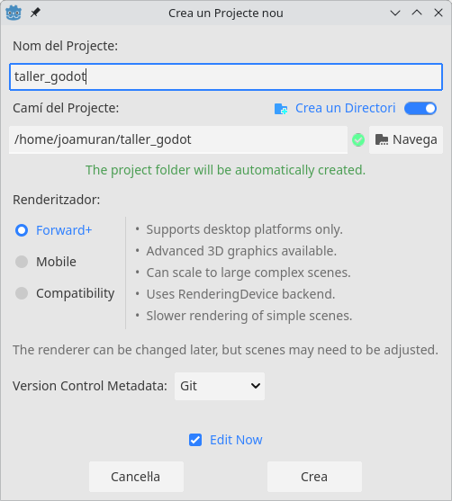
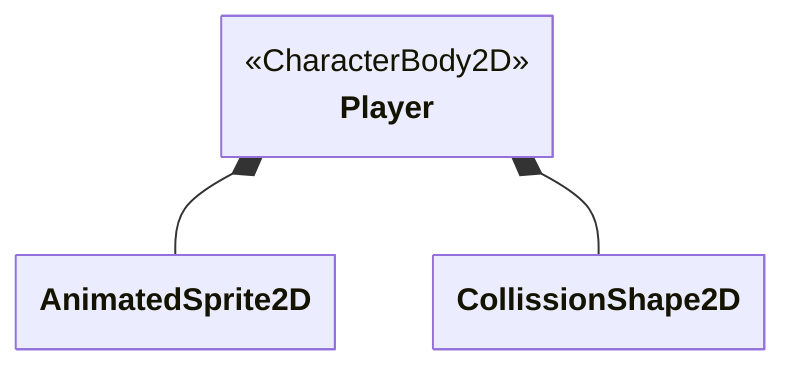
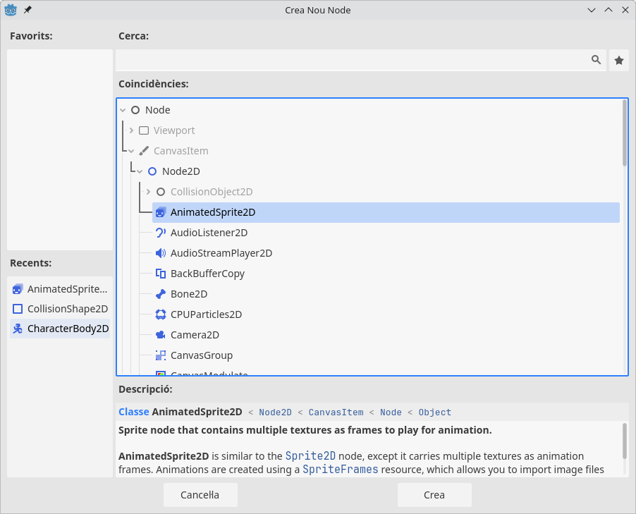
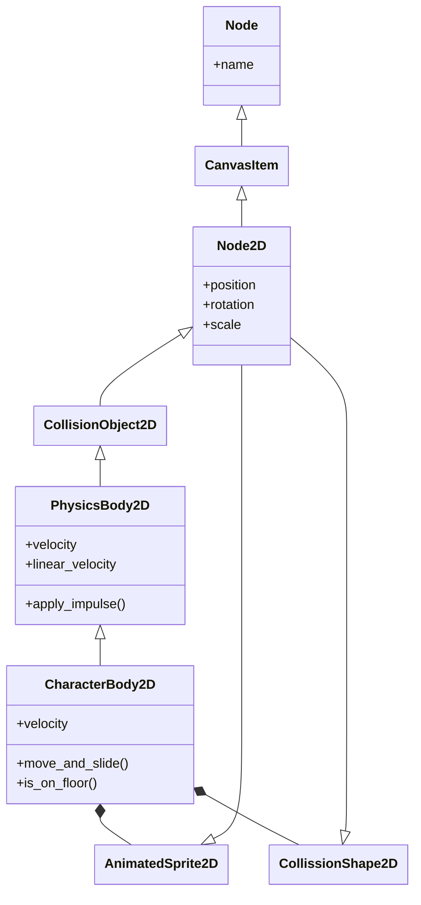

## 1. Introducció a Godot i preparació del projecte

### Què és Godot?

Godot és un motor de jocs **lliure i de codi obert**, ideal per a crear videojocs 2D i 3D. Té una interfície intuïtiva, suport multiplataforma i un llenguatge de programació propi anomenat **GDScript**, inspirat en Python.

!!!note "Descàrrega de Godot"
    Podem descarregar Godot des de la seua web [godotengine.org](https://godotengine.org/). La versió actual és la 4.4.1.

    Una vegada a la secció de descàrregues podem tiar entre:

    * **Godot Engine**: La versió estàndard, que utilitza el llenguatge natiu GDScript.
    * **Godot Engine .NET**: La versió per a .NET que fa ús de C# com a llenguatge de programació.

    Triarem la versió estàndard, i com veurem, és un fitxer comprimit amb menys de 100mb.

    Una vegada descarregat només haurem de descomprimir el .zip i llançar l'executable resultant.

### Entorn de treball

En obrir Godot trobem el gestor de projectes, des d’on podem crear un projecte nou o obrir-ne un existent.

Per tal de crear un projecte:

1. Obrim Godot i seleccionem **+Crea** per crear un nou projecte.
2. Li donem un nom (per exemple `taller_godot`)
3. Triem la carpeta on es guardarà.
4. Seleccionem **Renderer**: `Forward+` (els altres són optimitzacions per a mòbils i un mode per compatibilitat amb sistemes amb menys recursos)
5. Cliquem **Crea**



!!!note "Projecte de base"
    Com que ja se us proporciona un projecte de base, només huareu de seleccionar *Importa* per obrir el projecte.

### L'editor de Godot

L'editor de Godot té el següent aspecte:

{ width=400px }

On trobem els següents elements:

* **Menu principal**: Es tracta del menú de l'aplicació des d'on accedir a les funcionalitats principals del programa, com obrir, guardar projectes, configurar l’editor, etc.
* **Workspaces**: Godot compta amb diferents espais de treball (2D, 3D, Script, AssetLib) que podem canviar segons el tipus de tasca que estem realitzant. Cada espai de treball està estructurat per als diferents tipus de treball que estem fent.
* **Barra d'eines (Toolbar)**: La barra d’eines ofereix accés ràpid a les eines i les funcions més comunes, com moure, rotar, escalar objectes, entre d’altres. Aquesta barra variarà en funció de l'espai de treball on ens trobem.
* **Playtest buttons**: Ens permeten controlar l'execució del projecte que estem desenvolupant per provar-lo des del mateix editor.
* **Vista de l’escena i Viewport**: És la zona principal de treball, on podem veure i editar les escenes del joc. En el mode 2D, veiem una vista plana, mentre que en el mode 3D, disposarem d'una vista tridimensional.
* **Panell inferior (Bottom Panel)**: Conté diverses eines d'utilitat com la consola d'eixida, el depurador, o els editors d'àudio i animacions.
* **Tab de l’arbre de l’escena**: Mostra la jerarquia d'objectes (nodes) de l'escena actual, des d'on podem gestionar els nodes d'aquesta.
* **Tab de recursos del projecte**: Ens mostra els recursos del projecte, tals com scripts, imatges, sons, etc. És com un explorador de fitxers integrat dins de l’editor.
* **Tab amb l’inspector**: Ens mostra les propietat de l'objecte (node) seleccionat, i ens permet la seua modificació.

### Configuració inicial del projecte

Per a jocs 2D, i especialment si utilitzem píxel art, és important **establir bé la resolució** i **escalar correctament** la finestra.

**Configuració recomanada per al taller:**
* Resolució base: `800 x 450` (Ideal per píxel art)
* Resolució de finestra: `1280 x 720` (Escalat més clar en pantalles modernes)

Per tal de configurar el projecte:

* Accedim a `Project → Project Settings → Display → Window → Size`, i establim:
    * `Viewport Width`: `800`
    * `Viewport Height`: `450`
    * `Window Width Override`: `1280` (cal activat *Advanced Settings*)
    * `Window Height Override`: `720` (cal activat *Advanced Settings*)
    * `Stretch → Mode` : ViewPort (per ajustar la finestra al *ViewPort*)

A més, per a l'escalat de píxels (important per píxel art):

- A `Rendering → Textures → Canvas Texture → Default Texture Filter`: seleccionem `Nearest`: Això evita que els píxels apareguen difuminats quan escalen.

!!!note "Projecte preconfigurat"
    Tot i que ja tindreu configurat el projecte, comproveu que aquests paràmetres estan correctament ajustats.

### Estructura bàsica de Godot

**Godot treballa amb escenes i nodes**

- Una **Escena** és una unitat de joc: pot ser un personatge, un nivell, un botó…
- Cada escena es forma amb **Nodes**, que poden ser visuals (2D/3D), de col·lisió, sons, càmeres, scripts...

!!!note "...i en Godot no ens oblidem de la POO"
    En Godot, cada **node** és una instància d'una **classe**, i podem crear jerarquies i fer ús de l’**herència** per estructurar millor el nostre codi.

    El tipus de node que afegim a l’escena determina les *funcionalitats* que tindrà aquest node. A més, les **classes** que s’utilitzen en Godot segueixen un model d'herència que es reflecteix directament en les jerarquies de nodes.

#### Estructura del node jugador
   
Obri l'escena del jugador (`Characters/Player/player.tscn`), i observa que aquesta té la següent estructura:

```
Player (CharacterBody2D)
   └── AnimatedSprite2D
   └── CollisionShape2D
```

És a dir, l'escena del jugador està formada per un node que hem anomenat `Player` i que és un node de tipus `CharacterBody2D`. Aquest node conté dos nodes fills: `AnimatedSprite2D` i `CollissionShape2D`.

La relació entre aquests nodes és una **relació de composició** o **conté-un**:



Des del node *Player* podem gestionar els nodes `AnimatedSprite2D` i `CollissionShape2D`. A més, aquests nodes fills podrien tindre altres nodes fills, formant una jerarquia en forma d'arbre (coneguda com l'arbre de l'escena)

Hem dit que cada tipus de node determina la funcionalitat d'aquest. So fem clic en el botó `+` situat a baix la pestanya d'*Escena* per afegir un nou node, podrem veure tota la jerarquia d'aquests:



Observeu que els diferents tipus de nodes s'organitzen en forma d'arbre, i que podem anar aprofundint en aquest arbre per trobar el node que necessitem, o bé podem buscar-lo fent servir la barra superior. En aquest selector hem de tindre en compte alguns detalls:

* La relació entre els diferents nodes que apareixen aci és una **relació d'herència**. És a dir, cada node intern de l'arbre *deriva* o *descendeix* del node que apareix com a pare.
* Els nodes tenen una icona que els representa. El color d'aquesta determina el tipus: El color blau indica que són nodes per a 2D, el roig per a 3D, i el verd que són nodes per al disseny d'interfícies.
* Alguns nodes apareixen en gris. Això vol dir que es tracta de *classes abstractes*. És a dir, que no es poden instanciar directament.
* Cada classe defineix unes funcionalitats i propietats concretes. Des de l'editor del joc, i des del codi anem a poder accedir tant a les propietats del node com a les propietats dels seus nodes ascendents.

!!!question "Fem una prova..."
    Des de la finestra de selecció observeu quin és el camí en l'arbre fins arribar, perr exemple al node de tipus *AnimatedSprite*.

    Fixem-nos també en l'*Inspector*, ubicat a la part dreta de l'editor. Des d'aquest apart de la intefície podem ajustar les diferents propietats del node seleccionat.

    Contrasteu el camí que hem vist en la finestra anterior per arribar al node *AnimatedSprite2D* amb l'organització de l'*Inspector* per a aquest node. Quines conclussions podem extraure?

Una vegada hem entès bé la relació entre els diferents tipus de nodes, veiem per a què serveixen aquests:

- **`Node`**: La classe més bàsica que permet la creació d'escenes.
- **`CanvasItem`**: Classe per a nodes que poden ser dibuixats (en 2D).
- **`Node2D`**: Hereta de `CanvasItem` i és la classe bàsica per a nodes en un espai 2D (per exemple, sprites, càmeres, etc.).
- **`CollisionObject2D`**: Hereta de `Node2D` i és la classe base per a objectes que poden tenir col·lisions en l'espai 2D.
- **`PhysicsBody2D`**: Hereta de `CollisionObject2D` i és la classe base per a objectes físics en el món 2D (cossos que interactuen amb la física).
- **`CharacterBody2D`**: Especialització de `PhysicsBody2D`, dissenyada per a personatges que interactúen en el joc o entitats controlades per l'usuari. A més, proporciona funcionalitats avançades per al moviment (com el mètode `move_and_slide` que veurem després).

Com hem vist a l'Inspector, quan utiliem un node tenim accés a totes les propietats i funcions de les classes superior. A mode d'exemple, per a un *CharacterBody2D* podem ajustar propietats de classes ascendents com:

* **`Node2D`**: Ens permet treballar amb la posició, rotació i escala del node (propietats `position`, `rotation`, `scale`)
* **`CollisionObject2D`**: Ens permet gestionar col·lisions en 2D (mètodes `add_collision_exception_with()`, `set_collision_layer()`, `set_collision_mask()`)
* **`PhysicsBody2D`**: Ens permet treballar amb la física 2D (gravetat, moviment, etc.) (mètodes com `apply_impulse()` o propietats com `velocity`, `linear_velocity`).
* **`CharacterBody2D`**: Ens permet gestionar personatges jugables amb funcionalitats com el **mètode `move_and_slide()`**, per desplaçar el jugador o `is_on_floor()` per saber si és a terra.

#### Diagrama de classes complet

Tenint en compte tot el que hem vist, el diagrama de classes quedaria de la següent forma:



Com veiem:

* La nostra escena *Player* consisteix en un node principal *CharacterBody2D* que és una composició d'*AnimatedSprite2D* i de *CollissionShape2D*. 
* Cadascuna d'aquestes classes té el seu comportament independent, però en conjunt formen el personatge jugable.
* Quan creem un node *CharacterBody2D*, automàticament estem adquirint les propietats i funcions de *PhysicsBody2D* i *CollisionObject2D*, que ens permetran treballar amb física i col·lisions de manera més detallada.Així, podem configurar les propietats físiques (com la gravetat o la velocitat) a *CharacterBody2D*, però també tenim accés a funcions de col·lisió i moviment que provenen de les classes superiors.


