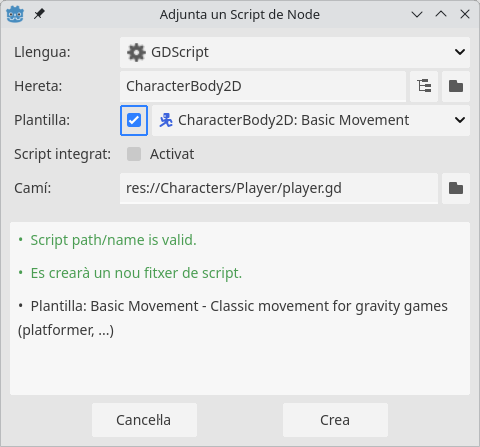
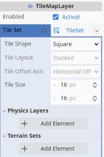
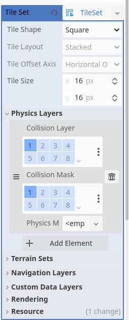
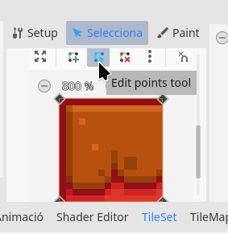
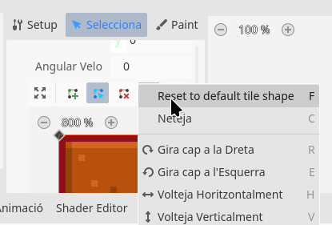

## El Personatge Principal

L'escena del personatge ja conté la següent estructura bàsica:

```
Player (CharacterBody2D)
   └── AnimatedSprite2D
   └── CollisionShape2D
```

1. **CharacterBody2D**: El node principal, que gestiona el moviment i les interaccions físiques del personatge.
2. **AnimatedSprite2D**: Un node fill que mostra les animacions del personatge (Idle, Running, Jumping, etc.). <!-- Podem fer que vegen les propietats en l'editor -->
3. **CollisionShape2D**: Un node fill que defineix la forma de col·lisió del personatge.

!!!caution "Sobre l'ordre dels nodes"
     Cal tindre en compte que l'ordre que establim entre els nodes fills determina com vorem el node pare a l'editor. En aquest cas, veurem el CollissionShape per sobre de l'AnimatedSprite.

!!!important "Sobre la posició del personatge"
     És important que el personatge estiga centrat en la posició (0,0).

     Fixeu-vos que el personatge es troba ubicat entr dues línies: una horitzontal i roja/magenta que representa l'origen de coordenades en l'eix vertical (y=0), i una vertical en verd, que representa l'origen de coordenades en l'eix horitzontal (x=0). Per tant, el personatge es troba en la posició (0,0).

     Això ho podeu comprovar també en la propietat *Transform/Position* que hereta del *Node2D*.

     A més, si ampliem la pantalla, veurem que, junt amb aquests dos eixos, apareix un requadre en blau. Aquest requadre és el *ViewPort*, és a dir, l'espai de pantalla que veurà l'usuari, i que hem definit a les propietats del projecte.

     Si feu clic al botó de reproduir l'escena actual (el Play dins la claqueta), veureu com el personatge apareix al cantó superior esquerre.


## L'escena PlayerTest

Per tal d'ajustar els moviments del jugador, hem preparat una escena anomenada PlayerTest (`levels/PlayerTest.tscn`). Carregueu-la.

Aquesta escena, consta d'un Node2D com a node principal, que a dins conté un node de tipus `TileMapLayer` anomenat `GroundLayer`. Els Tilemaps són, com diu el nom *mapes de tiles* que podriem traduir per *rajolets*, que no són més que imatges menudes que es combinen i repeteixen per formar un escenari.

!!!note "Més sobre Tilemaps"
     * [Tilemaps i TilemapLayer, als apunts de PMDM](https://joamuran.net/curs24_25/pmdm/u10/3.escena_principal/#tilemaps-i-tilemaplayer)


<!-- Eliminem el jugador de l'escena que els anem a passar! -->

!!!question "To-Do"
     Ara el que volem és incorporar el jugador a l'escena, o més bé, una *instància* del jugador.

     Per a això, amb aquesta escena oberta, només caldrà que busquem l'escena del jugador i l'arrosseguem a aquest aescena.

     Proveu a fer-ho, i feu clic en el botó de reproduir l'escena, per veure que tot es veu correctament.

### Afegint Funcionalitat al Personatge

La funcionalitat als personatges s'incorpora mitjançant scripts amb el llenguatge GDScript.

En Godot, cada node pot tindre associat com a molt un script per modelar el seu comportament. Això s'aconsegueix amb el botó *Attach Script*.

!!!caution "Compte"
     Generalment, voldrem que totes les instàncies d'un tipus d'escena (Classe) tinguen el mateix comportament. Per això, l'script s'ha d'associar a l'escena o al node de l'escena que es desitge, i no a les instàncies concretes.

     Al nostre cas, per exemple, tot i que podríem afegir un script al jugador que hi ha dins l'escena, el que farem serà afegir l'script a l'escena Player en sí, i no a aquesta instància.

     Observeu que el node del *Player* que hem instanciat en aquesta escena conté, en la finestra de l'arbre d'escena una icona d'una claqueta al costat. Fent clic en ella, podem editar l'escena del jugador.

Així doncs afegim un script a l'escena del jugador per controlar aquest:

{ width=400px }

Com veieu, **hem seleccionat una plantilla de moviment bàsic per a un CharacterBody2D**, i hem guardat l'Script junt a l'escena del jugador.

Com veureu, ha aparegut un nou símbol al costat del node del jugador, indicant que aquest té un script associat. Aquest Script apareixerà tant a l'escena del jugador com en totes les instàncies que fem d'ell.

!!!note "Com funcionen els scripts...?"
     Abans d'examinar el codi dels scripts cal entendre una mica com funciona el *bucle del joc*.

     Quan executem un videojoc, aquest s'executa dins un bucle, que no s'atura fins que acaba el joc. Aquest bucle s'executa tantes vegades com Frames Per Segon (FPS) tinguem configurats (valors habituals són 30/60 FPS). Cada passada del bucle genera com a resultat un frame, és a dir, la imatge que es mostra en pantalla, i per generar-la es fan moltes operacions prèvies.

     Aquest bucle passa per diferents fases de manera ordenada, entre elles l'aplicació de les físiques, els càlculs de col·lissions, renderitzats, etc. Durant l'execució d'aquestes fases s'invoquen diferents funcions o mètodes dels Scripts que programem, a mode de callbacks.

     Per tant, la nostra tasca quan programem scripts en Godot és la de *preparar* aquestes funcions per a que en cada fase es realitze allò que desitgem.

Feta aquesta aclaració, podeu examinar el codi de l'script que hem incorporat. Fixeu-vos en els següents detalls:

* Tot i que no definim una classe, estem *estenent* la funcionalitat d'un node, la qual cosa s'indica en la primera línia amb `extends CharacterBody2D`. Amb això *heretem* totes les propietats i mètodes del CharacterBody.
* Definim un parell de constants com SPEED i JUMP_VELOCITY (per què aquesta és negativa?).
* Implementem una funció `_physics_process`, que rep un paràmetre `delta`. Aquesta funció s'invoca a cada pas d'actualització de les físiques. El paràmetre delta indica els segons transcorreguts des de l’anterior frame, la qual cosa ens serveix per fer animacions independents del framerate.

!!!note "Exemple pràctic sobre el framerate i delta"
     Imagina que un joc es llança a 60FPS. Vol dir que en un segon el bucle es llança 60 vegades. Si en cada passada del bucle un personatge avança 1 píxel, al cap d'un segon haurà avançat 60 píxels.

     Ara bé, si el joc s'executa a 30FPS, què passa? Quants píxels haurà avançat en 1s? La veloditat serà la mateixa?

     Si introduim un paràmetre `delta`, que és el temps que ha passat des que es va renderitzar l'últim frame, què passarà? Amb 60FPS, `delta=1/60` (aprox 0.0167s), i a 30FPS, `delta=1/30` (aprox. 0.0333s).
     Què passa en cada cas, si fem que el personatge avance $60*delta$ píxels? Quant haurà avançat en 1 segon?
     
     - Amb 60 FPS el personatge es mourà 60 * (1/60) = 1 píxel per frame, com esperem.
     - Amb 30 FPS el personatge es mourà 60 * (1/30) = 2 píxels per frame, compensant la menor taxa de frames.

     Per tant: 

     - A 60 FPS, el personatge es mou 60 píxels en 1 segon, avançant 1 píxel per fotograma.
     - A 30 FPS, el personatge es mou 60 píxels en 1 segon, avançant 2 píxels per fotograma, per mantindre la mateixa velocitat, gràcies a l'ajustament per delta.

Ara ja podeu entendre millor aquesta funció `_physycs_process`. Intenteu entendre què fa, fent-vos les següents preguntes:

* Què creieu que fa la funció `is_on_floor()`?
* Què creieu que fa la funció `get_gravity()?
* I els mètodes `Input.is_action_just_pressed("ui_accept")` i `Input.get_axis("ui_left", "ui_right")`?
* I la funció `move_and_slide()`?

!!!note "Input per al salt"
     L'script predeterminat per al moviment que hem afegit fa ús dels cursors per al moviment horitzontal i de la tecla `ui_accept` (tecles d'*Espai* o *Enter*):

     ```gdscript
     if Input.is_action_just_pressed("ui_accept"):
     ```

     Anem a reemplaçar aquesta per la fletxa del cursor cap amunt. Per això reemplaçem `ui_accept` per `ui_up`:

     ```gdscript
     if Input.is_action_just_pressed("ui_up"):
     ```

     


!!!question "TO-DO"
     Prova ara a llançar l'escena i comprova el funcionament. Intenta interactuar amb la plataforma que apareix a sobre. Has pogut fer-ho?

     Treballem una miqueta amb els **TileMaps**!

### Configurant l'escena

El node que representa el sol i les plataformes és un node de tipus `TileMapLayer`, que conté una propietat `TileSet`, que és el *conjunt de Tiles* o imatges que podem utilitzar per dissenyar les nostres pantalles.

Si fem clic en el *TileSet* ens apareix a la part inferior la configuració d'aquest. Al nostre exemple ja tenim importat el TileSet, pel que podem utilitzar-lo directament. [Podeu llegir una miqueta de documentació per veure com es fa aquest procés](https://joamuran.net/curs24_25/pmdm/u10/3.escena_principal/#que-son-els-tilemaplayers)

Si estem a la vista de disseny 2D i seleccionem el *TileMap*, podem *pintar* seleccionant els Tiles que volem i situant-los en l'escena.

#### Configurant col·lissions al Tilemap

Si volem que els tiles que afegim actúen com a elements físics i puguen detectar col·lissions, cal configurar-ho al TileMap.
 
Per a això, seleccionem el `TileMapLayer` en qüestió (GroundLayer), i busquem a l'Inspector l'apartat *Physics Layer* el botó `Add Element`.

{ width=400px }

Com veurem, ara tenim el Tilemap en Collission Layer 1 i Collission Mask 1. Què significa això?

{ width=400px }

!!!note "Els physics Layers"
     El sistema de *Physics Layers* ens permet controlar com interactúen els objectes físics en el joc, i per a això necessitem capes i màscares de col·lissió. 

     * **Collision Layer (Capa de Col·lisió)**: Indica en quina capa o quines capes es troba un objecte. Un objecte pot estar en 32 capes com a màxim. 
     * **Collision Mask (Màscara de Col·lisió)**: Indica amb quines capes pot col·lisionar un objecte.

     Aquest sistema ens dona més joc a l'hora d'establir els sistemes de col·lissió. Per exemple, podem ubicar el jugador en la capa 1, i indicar com a màscara la capa 2, on estiga per exemple el terreny i les plataformes, i la 3, on estan els enemics. Amb això, el jugador col·lissionarà amb les plataformes i els enemics, però no amb altres jugadors.

Si desitgem que un Tile puga col·lissionar, caldrà dnar-li una forma. Això ho podem fer des de la pestanya inferior de TileSet. Amb el Tile que volem seleccionat, a l'eina *Selecciona* buaixem fins arribar a l'apartat de *Physics > Physic Layer 0*, des d'on podriem crear la forma de col·lissió que tindrà el Tile, amb l'eina *Edit points tool*.

{ width=300px }

Si el que volem és seleccionar la forma completa del rectangle del Tile, podem fer-ho des del menú dels tres puntets, i seleccionant *Reset to Default tile Shape*:

{ width=350px }

!!!question "TO-DO"
     Crea ara la forma per als Tiles de la plataforma, per a que puguen col·lissionar amb el jugador.

### Afegint Animacions al Personatge

Ara que tenim el moviment i una interacció bàsica amb l'entorn, és el moment d'afegir les animacions. El node **`AnimatedSprite2D`** del personatge ja conté les animacions preconfigurades, per a l'estat de repòs (*iddle*), caminar (*run*) i botar (*jump*).

Aleshores, el que farem és afegir una funció per gestionar les animacions en funció de l'estat del personatge (si està a terra, botant, corrent, etc.)

En primer lloc, abans de les funcions declarem una referència al component *AnimatedSprite2D*:

```gdscript
@onready var animated_sprite = $AnimatedSprite2D
```

I després definim el mètode:

```gdscript
func update_animations():
    if is_on_floor():
        if velocity.x != 0:
            animated_sprite.play("run")
        else:
            animated_sprite.play("idle")
    else:
        if velocity.y < 0:
            animated_sprite.play("jump")
        else:
            animated_sprite.play("fall")
```

Aquest mètode s'invocarà abans d'invocar el mètode `move_and_slide` en `_physics_process`:

```gdscript
func _physics_process(delta: float) -> void:
	...

	# Actualitzar animacions
	update_animations()

	move_and_slide()
```

Si llancem l'escena, ara el jugador és animat, però mira sempre cap a la dreta. Per tal que el personatge mire en la direcció en què camina haurem d'afegir una xicoteta modificació.

En primer lloc, definim una propietat que ens indique si mira cap a un o altre costat:

```gdscript
var mira_esquerra = false  # Variable per recordar l'última direcció del moviment
```

I al final del mètode que actualitza les animacions fem:

```gdscript
	if (velocity.x<0):
		mira_esquerra = true  # Recordem si ens movem cap a l'esquerra
	elif (velocity.x)>0:
		mira_esquerra=false
		
	animated_sprite.flip_h = mira_esquerra  # Flip horitzontal si es mou cap a l'esquerra
```

!!!question "Com interpreteu el codi anterior...?"
     * Quines comprovacions estem fent?
     * Què fa la propietat `flip_h` del node *AnimatedSprite2D*?

!!!question "Late TO-DO: Doble salt"
     
     Com podríem fer que el personatge poguera fer un *doble salt*?

     Algunes pistes:
     - Crear una variable `double_jump` per controlar el doble salt.
     - Quan el jugador estiga a l'aire i prema el botó de salt, permetrem un segon salt si `double_jump` està activat.

