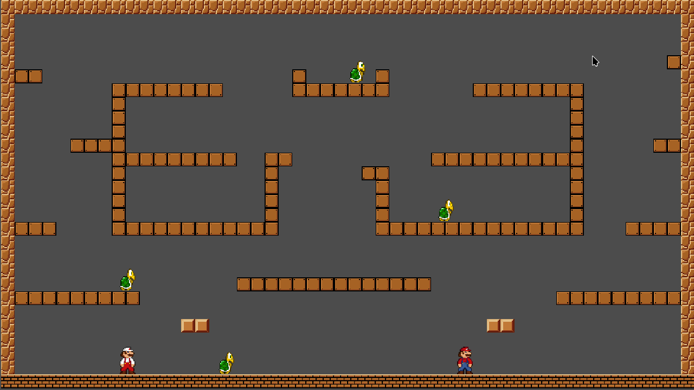

# Crea el teu nivell!

Ara et toca a tu crear un nivell jugable complet, amb l'escenari, els enemics, i dos jugadors. Per a això, segueix els següent pasos.


## Pas 1. Creació de l'escena i el TileMap

1. Crea una nova escena (*Escena* > *Nova Escena*), i afig com a arrel un Node2D.
2. Afig com a fill un *TileMapLayer*
3. Amb el *TileMapLayer* seleccionat, des de l'Inspector, associa-li un nou *TileSet*.
4. Selecciona el TileSet a l'Inspector i accedeix a la pestanya *TileSet* de la part inferior.
5. Busca en l'explorador de recursos el recurs `assets/Mario1/TileSets/OverWorld.png` i arrossega'l a la finestra `TileSource`. Quan se't pregunte per la creació automàtica de l'Atlas, indica que sí.
6. Fes ús de les eines de dibuix per dissenyar el nivell.
7. **No t'oblides de generar la capa *Physics Layer* des de l'editor i definir la forma dels Tiles des del TileSet!**

## Pas 2. Afig el jugador principal un un segon jugador

1. Arrossega l'escena del Player on desitges que comence aquest
2. Dispose també d'una escena `player2.tscn`, que conté un altre jugador. Afig-lo també a l'escena.
3. El Player2 no té un script associat encara, així que **edita l'escena del jugador** i afig-li un Script. Aquest script serà na còpia de l'script del jugador1, amb les següents diferències:

     * Modifica la línia per detercar el bot:

    ```gdscript
    # Modifiquem aquesta línia
    if Input.is_action_just_pressed("ui_up"):

    # Per aquesta altra:
    if Input.is_action_just_pressed("ui_up_player2"): 
    ```

    El control `ui_up_player2` ja s'ha configurat al projecte que se us proporciona amb la tecla `W`.

    * Modifica les línies pe detectar el moviment horitzontal:

    ```gdscript
    # Modifiquem la línia:

    var direction := Input.get_axis("ui_left", "ui_right")

    # Pel següent codi:

    # Agafem la direccio
	var direction := 0  # Default to no movement

	if Input.is_action_pressed("ui_left_player2"):  # Configurat per a A
		direction = -1
	elif Input.is_action_pressed("ui_right_player2"):  # Configurat per a D
		direction = 1
    ```

## Pas 3. Afegir enemics

Finalment, arrossega el personatge enemic per tal de crear vàries instàncies d'aquest.

Aci tens un exemple de com pot quedar aquest nivell:



